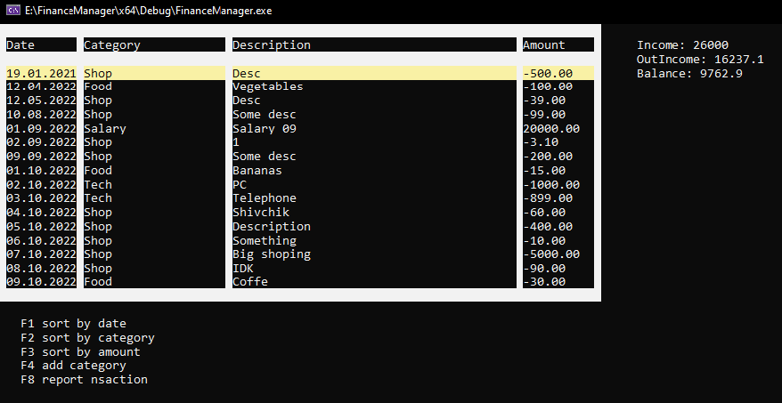

# FinanceManager
This program was written by me. It is used to calculate one's own finances.
The program works correctly! This is the plan according to which the code was executed:

```
//Система "особисті фінанси"
//
//Рахунок.По рахунку є витрати та доходи.Баланс.Назва рахунку.
//Рахунків може бути декілька.
//Витрати. - категорія, опис, сума, дата.
//Дохід - категорія, опис, сума, дата.
//
//Створити рахунок.
//Вносити витрати.Видалити витрату.Змінити витрату(суму, дату та категорію та опис)
//Вносити дохід.Видалити дохід.Змінити дохід(суму, дату та категорію та опис)
//
//Вивод списку доходів та витрат по 30 на сторінку, з можливістю переходити по сторінках.
//
//Дані зберігаються в файл при закритті програми та читаються за файлу при завантаженні програми.
//
//Звіти.
//Звіт за останні 30 днів. (дата, дохід, витрати за кожен день)
//Звіт за місяць(загальний дохід, загальні витрати, баланс початку, баланс на кінець періоду)
//Список категорій з сумобю витрат по ним за місяць, від найбільшого до найменьшого.
//Звіт - 3 найдорожчі покупки(витрати)
//
//Можливість зберегти звіт в файл.
```
